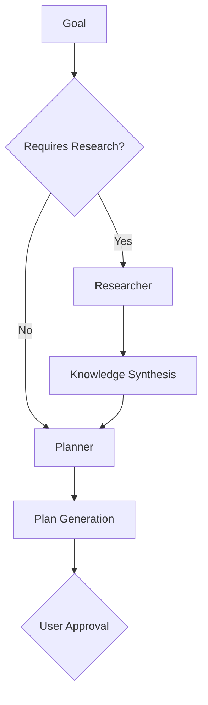

# Mirabel

> An AI software developer, by use of multiple agents.

## Inspiration
- [Devin](https://devin.ai)
- [OpenHands](https://github.com/All-Hands-AI/OpenHands)

## Overview

Mirabel works in parallel with you, the developer, to help you write code, fix bugs, create new features, and more. The user interface consists of a chatbot that can be accessed through the browser. The work that needs to be done is discussed, Mirabel will draw up a plan, once approved by the user, Mirabel will start working on the task.

## Terminology

- `Organization` - A company level structure that contains multiple repositories.
- `Repository` - A repository is a collection of files that are tracked by git.
- `Modules` - Sub-systems that make up the backend of the system.
- `Agent` - Uses LLM's to perrform a small task.
- `Workflow` - A series of tasks that need to be done to achieve a goal.
- `Task` - A single prompt which is evaluated by an LLM.
    - `StructuredTask` - A task which's output can be mapped to a struct, usually involves generating json.
    - `UnstructuedTask` - A task which's output cannot be mapped to a struct, usually involves generating human language, code, etc.
- `Interrupt` -
    - `UserInterruprt` - An interrupt caused by the user, e.g. asking for a change in the plan while it is being executed.
    - `AgentInterrupt` - An interrupt caused by one of the agents, e.g. the planned implementation is not possible, usually followed by a detour.
- `Detour` - A task inserted into the plan to handle an interrupt.
- `Plan` - A series of workflows that need to be done to achieve a goal. A workflow can have a workflow as a child. It is a hierarchical task list.
- `Goal` - A verbal description of the task that needs to be done. Can be as simple as "create a directory", or as complex as "implement a product recommendation system". Each workflow has a goal.
- `Step` - An atomic action taken to achieve a goal, e.g. run a shell command, verify the output of a command, insert a file edit, etc.
- `Requirement` - A user specified necessity, e.g. "use python 3.12".

## Modules

Modules are sub-systems that make up the backend of the system. Each module is then broken down into smaller agents that work together to achieve a common goal. In this section we will use an example to explain the modules, the user wants to setup a new "hello world" rust project.

### Communication

This module handles the communication between the users and Mirabel. The primary way of communication is through a chat interface. The user can send messages, documents, and images to Mirabel. Mirabel can also send messages, documents, and images to the user. Other methods of communication can be added in the future (slack, discord, teams, etc.).

- `Question`: A different module needs to know something from the user. For example, the Programmer needs to know what kind of conventions the user wants to use (would only get asked in newer organizations where the memory doesn't have enough knowledge yet).
- `Status`: It is given a status from a relevant module which is then communicated to the user.
- `General`: The user might ask questions about the codebase, the system, or anything else. This agent is used when we don't need to DO something, think atomic questions.
- `Approval`: The user needs to approve a plan before it can be executed.
- `Feedback`: The user needs to give feedback on a module's decisions, e.g. user wants to use a different library than the one suggested by the Programmer.

### Orchestrator

The orchestrator is the main module that controls the flow of the system. It is responsible for managing the agents and their workflows. The orchestrator is responsible for the following:

- `Agent Management`: What agent should do which task and when.
- `Interrupts`: Should we re-plan or is a simple detour enough?

### Planner

Is used by the orchestrator to generate a plan for the task that needs to be done. The plan is then sent to the user for approval. The user can then approve the plan or make changes to it (or auto-approved by user settings). Once the plan is approved, the orchestrator will start working on the task.

- `Goal subdivider`: Divide the goal into smaller tasks.
- `Check atomic goal`: Can this goal be achieved by a few logically groupable Steps?
- `Goal Type`: Which module should be used to achieve this goal?

The planner generates the entire hierarchy of tasks that need to be done to achieve the goal, e.g. "Setup a new rust hello world project". The planner should generate a plan that looks like this:

```md
1. Create a new rust project using the cargo command.
    1. Run `cargo new hello_world`.
    2. Verify `shell_output` (hist[[0]])
2. Verify that the project was created successfully.
    1. Use tree to verify that the project was created.
        1. Run `tree`.
        2. Verify `shell_output` (hist[[0]])
3. Enter the project directory.
    1. Run `cd hello_world`.
    2. Run `pwd`
    3. Verify `shell_output` (hist[[0]])
4. Verify that the program runs successfully.
    1. Run `cargo run`
    2. Verify `shell_output` (hist[[0]])
5. Initialize a git repository.
    1. Run `git init`
    2. Verify `shell_output` (hist[[0]])
6. Commit all the initial files.
    1. Run `git add .`
    2. Run `git commit -m "Initial commit"`
    3. Run `git --no-pager log`
    3. Verify `shell_output` (hist[[0:2]])
```

### Researcher

This module is responsible for finding information that is needed to complete a task. The researcher can search the web, read documentation, and more. The researcher is used by the other modules to find information that is needed to complete a task. Primarily uses `ReAct` prompting to get the information needed.

- `ReAct`: Find the answer to a question. **Example** Q: What is the current prefered python package manager? A: `pip` with virtual environments.
- `Project Ingest`: Is used when Mirabel is first introduced to a project. It will read the project's documentation, code, libaries, etc. to get a better understanding of the project. This will then be stored with the help of the Memory module.
- `Documentation`: Find the documentation for a library, language, etc., then ingest it into the Memory module.
- `SearchEngine`: Search the web for information, by default using `searxng`.

### Tool Integration

Without the tools module, Mirabel would be all talk and no action. This module is responsible for interfacing with the tools that are needed to complete a task. The tools module is used by the other modules to run commands, edit files, and more.

- `Shell`: Run shell commands, and verify the output.
- `Docker`: All shell commands that have to do with docker are run through this agent. Since Mirabel is running in a docker container, we need this layer to convert docker commands to be compatible with Docker-in-Docker.
- `File`: Edit files, create files, delete files, etc.

### Memory Management

Responsible for long-term knowledge storage and retrieval. Key components:
- **Project Knowledge Graph**: Stores relationships between code entities (files, classes, functions)
- **Documentation Vector Store**: Semantic search for technical documentation
- **Experience Cache**: Remembers successful patterns and past failures
- **Contextual Embedding**: Real-time codebase understanding through embeddings
- **Version Snapshotting**: Tracks code state at different planning stages

### Programmer

Core code generation/analysis module with sub-agents:
- **Code Synthesizer**: Generates code with style consistency checks
- **Static Analyzer**: Pre-execution validation using linters/type checkers
- **Test Architect**: Creates unit/integration tests with coverage goals
- **Refactoring Engine**: Identifies code smells and suggests improvements
- **Debugging Assistant**: Core dumps analysis + hypothesis testing

### Machine

Mirabel has her own personal "machine" that she uses to run code, test code, and more. This machine is an ubuntu docker container. The user can also access this machine through the web interface.

### Browser

Inside the machine Mirabel has a chromium browser that she uses to access the web. The browser is primaraly used for debugging and testing web applications in development. This browser is used to access documentation, search for solutions to problems, and more. The user can also help her with problems she encounters (e.g. authentication, captchas, etc.).

## Fault Recovery System

- **Error Classification Matrix**:

| Error Type | Response Protocol |
|------------|--------------------|
| Transient | 3x retry with backoff |
| Systemic | Replan with Researcher input |
| Critical | Human intervention request |

- **Post-Mortem Analysis**: Automatic root cause documentation
- **Knowledge Base Update**: Prevent repeat failures through memory updates

## State

> This state describes the current state of the application.

- `requirements
- `goal`
- `plan`

## Workflow

This is a description of the agents' workflows.

1. User submits goal via Chat interface
2. Orchestrator initiates Planning phase:



## System Requirements

> This document describes the system requirements for the application.

### Chat

- User can send messages to Mirabel.
- User can send documents to Mirabel.
- User can send images to Mirabel.
- User can link external resources to Mirabel, e.g. Github Issues, StackOverflow questions, library documentation, etc.
